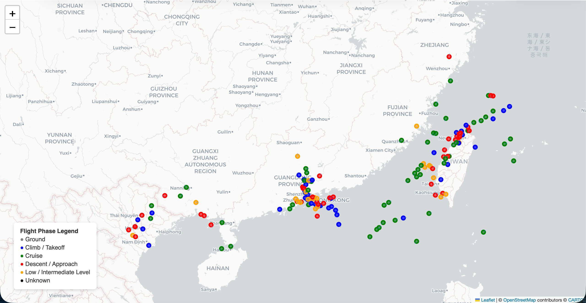

# East Asia Airspace Situation Analyzer

> 基于 OpenSky Network 公开 ADS-B 数据的东亚空域实时航班态势分析、飞行阶段识别与短期轨迹预测工具  
> Real-time East Asia airspace situation analyzer with flight phase classification and short-term trajectory prediction powered by open ADS-B data


---

## 📖 项目背景

**ADS-B**(Automatic Dependent Surveillance–Broadcast,自动相关监视—广播)
是现代民航监视体系(CNS/ATM)的核心技术之一。航空器通过机载应答机周期性
广播自身位置、高度、速度、航向等状态向量,地面站与其他航空器接收后用于
空中交通管制、防撞告警与飞行态势感知。

本项目通过调用 [OpenSky Network](https://opensky-network.org/) 开放 API,
实时获取东亚空域(北纬 20°–45°,东经 100°–140°,覆盖中国东部、日韩、
台湾、菲律宾北部)内所有在发射 ADS-B 信号的航空器状态,进行统计分析与
可视化,以观察真实的空域运行特征。

## ✨ 核心功能

- **实时数据抓取** —— 单次请求获取目标空域内全部在飞航班的状态向量
- **飞行剖面统计** —— 高度分布直方图、速度分布、航司/国籍分布
- **巡航层聚焦** —— 过滤 30k–40k ft 典型巡航层，计算平均地速并换算马赫数
- **地面态势识别** —— 区分滑行/停机航班与在飞航班
- **飞行阶段识别** —— 基于高度、垂直速度与地面状态，规则式区分爬升、巡航、下降、进近、地面等飞行阶段
- **短期轨迹预测** —— 基于当前经纬度、地速与航向，使用匀速运动模型预测航空器 60 秒后的短期位置
- **交互式地图** —— 基于 Folium 的空域快照，按飞行阶段染色，并用短线展示 60 秒预测轨迹
- **工程化配置管理** —— 凭据通过 `.env` 环境变量注入，代码与配置彻底分离

## 🔍 示例发现（固定样例快照：2026-04-20 21:00）

| 指标 | 数值 |
|------|------|
| 空域内有效状态航班 | **301** 架 |
| 巡航层(30k–40k ft) | 105 架 |
| 巡航层平均地速 | **819 km/h ≈ Mach 0.77** |
| 地面状态(滑行/停机) | 42 架 |
| TOP 5 航司(在飞) | 国航 16 / 南航 13 / 国泰 11 / 长荣 11 / 全日空 10 |

### 🎯 关键观察

**1. 巡航地速与物理模型自洽**

巡航层(30k–40k ft)105 架航班的平均地速为 **819 km/h**,换算约
**Mach 0.77**,与商用客机(A320 / B737 族系)的典型巡航马赫数
(Mach 0.78–0.82)高度吻合。采样数据在物理上自洽,验证了
OpenSky 数据质量与单位换算的正确性。

**2. 高度直方图揭示"巡航高度层"结构**

高度分布直方图在 30k–40k ft 区间出现显著尖峰,清晰可视化了
ICAO 规定的"标准飞行高度层(Flight Level)"—— 这是教科书中
CNS/ATM 的基础概念,在真实 ADS-B 数据中得到直观印证。

**3. 珠三角 TMA 结构清晰可辨**

珠三角交互地图快照中，广州–深圳–香港走廊附近的低空、爬升与下降航班呈现明显的高密度分布，对应 CAN / SZX / HKG 三大机场周边的
**终端管制区（Terminal Maneuvering Area, TMA）**。香港南侧海面附近的进近航迹呈现弧形或带状分布，体现了典型的**仪表进近程序（Instrument Approach）**
几何特征；高空巡航航班则更多分布在终端区外围，与“终端区–航路区”的空域分层相吻合。

## 🖼️ 可视化示例

### 1. 空域全景统计


左:高度分布直方图,30k–40k ft 区间出现巡航层尖峰。
右:空域内航班地理分布,颜色映射飞行高度。

### 2. 交互式空域态势地图与短期轨迹预测



地图按飞行阶段对航空器进行着色：蓝色表示爬升/起飞，绿色表示巡航，红色表示下降/进近，橙色表示低空或中间高度层。每架航空器旁的短线表示基于当前地速与航向计算得到的 60 秒短期位置预测，用于直观展示航空器在当前运动状态下的局部轨迹趋势。

### 3. 航班详情弹窗


点击地图上任意航班可查看呼号、航司、国籍、高度、地速、航向与飞行阶段等详情。

## 🛠️ 技术栈

| 类别 | 使用 |
|------|------|
| 数据获取 | `requests`, OpenSky Network REST API |
| 数据处理 | `pandas`, `numpy` |
| 静态可视化 | `matplotlib` |
| 交互地图 | `folium` (Leaflet.js + CartoDB Positron) |
| 配置管理 | `python-dotenv` |
| 语言 / 环境 | Python 3.9+ |

## 📁 项目结构

## 📁 项目结构

```text
east-asia-airspace-analyzer/
├── analyze.py                 # 基础统计与可视化（生成 airspace_snapshot.png）
├── advanced_analysis.py       # 巡航 / 地面 / 航司深度分析（命令行报告）
├── flight_phase.py            # 基于 ADS-B 状态变量的规则式飞行阶段识别
├── trajectory_prediction.py   # 基于匀速模型的短期航空器位置预测
├── map_view.py                # 交互式地图生成（飞行阶段着色 + 60 秒预测轨迹线）
├── requirements.txt           # 依赖清单
├── .env.example               # 凭据配置模板
├── .gitattributes             # GitHub 语言统计配置
├── .gitignore
└── README.md
```

## 🚀 快速开始

### 1. 克隆仓库

```bash
git clone https://github.com/JingyuZhang-ZFAI/east-asia-airspace-analyzer.git
cd east-asia-airspace-analyzer
```

### 2. 安装依赖

```bash
pip install -r requirements.txt
```


> OpenSky 对匿名访问有较低的速率限制(~400 次/天,10 秒延迟);
> 注册账号后可提升至 ~4000 次/天、5 秒延迟。账号在
> [opensky-network.org](https://opensky-network.org/) 免费注册。

### 3. 运行

```bash
python analyze.py              # 生成统计图 airspace_snapshot.png
python advanced_analysis.py    # 打印巡航 / 地面 / 航司分析报告
python map_view.py             # 生成交互地图 airspace_map.html（飞行阶段着色 + 60 秒预测轨迹）
```

## 📡 数据来源

本项目使用 [OpenSky Network](https://opensky-network.org/) 的
公开 `states/all` 接口。OpenSky 是一个由学术机构维护的开放 ADS-B
数据平台,数据由全球志愿者部署的接收机贡献,在民航研究界被广泛使用。

**API 文档:** https://openskynetwork.github.io/opensky-api/rest.html

## 🔮 未来计划

- [ ] **飞行阶段识别优化** —— 引入连续时间轨迹信息，减少单帧 ADS-B 数据导致的误分类
- [ ] **Kalman 滤波轨迹平滑** —— 在当前匀速预测模型基础上，引入滤波方法处理 ADS-B 观测噪声
- [ ] **历史轨迹回放** —— 接入 OpenSky 的 Flights API，复盘特定航班的完整飞行剖面
- [ ] **气象关联分析** —— 结合高空风场数据，分析巡航层地速与风速、风向的相关性
- [ ] **高密度航路识别** —— 通过轨迹聚类发现“上海–东京”、“珠三角–台北”等典型航路的流量特征
- [ ] **适航数据格式对齐** —— 将输出对齐 ASTERIX CAT 021（ADS-B 监视数据标准），向工业界数据格式靠拢

## 📚 相关背景知识

对 ADS-B 与 CNS/ATM 不熟悉的读者,可参考:

- **ADS-B 技术概述** —— ICAO Annex 10 Volume IV
- **终端管制区(TMA)与空域分层** —— ICAO Doc 4444 (PANS-ATM)
- **航电适航标准** —— RTCA DO-260B (ADS-B MOPS), DO-178C (软件)

## 📝 许可证

MIT License

## 👤 作者

**张京宇** —— 北京航空航天大学中法航空学院

- GitHub: [@JingyuZhang-ZFAI](https://github.com/JingyuZhang-ZFAI)
- Email: zhangjingyu777@buaa.edu.cn

如果这个项目对你有启发,欢迎 ⭐ Star;欢迎通过 Issue 提出改进建议。

---

*Built with curiosity about how the sky actually works.* ✈️